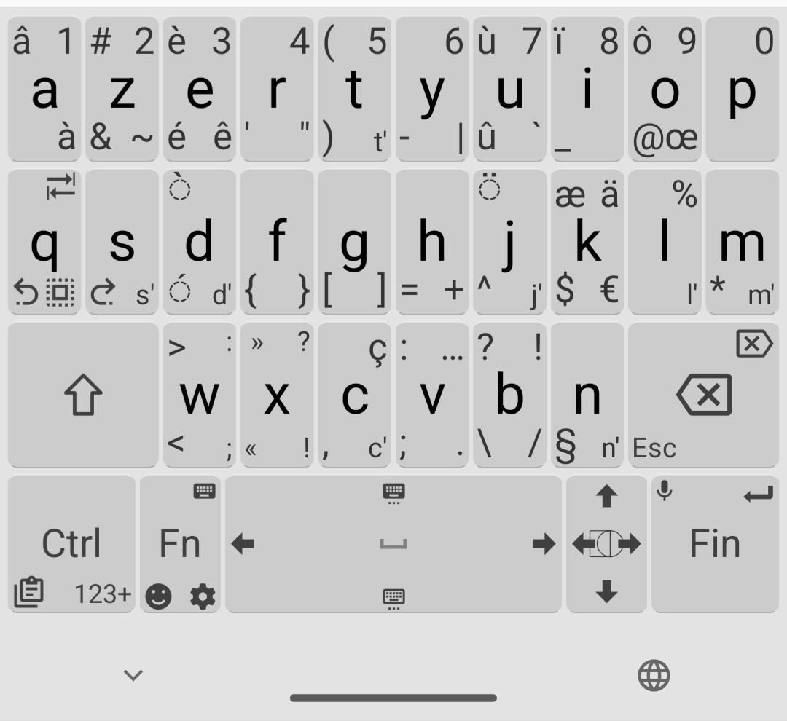

# Azerty Alternative Keyboards

## AZERTY (Français Typographe)

Adapted version of [the original AZERTY (Français)](https://github.com/Julow/Unexpected-Keyboard/blob/master/srcs/layouts/latn_azerty_fr.xml)
with logic placements and French typography in mind instead of mimicisming hardware standard `NF Z71-300` keyboard.

- Group accentuated letters with the main letter :
  - `éèê` with `e` not with `u`, `d` etc
  - `à` with `a`
  - `ûù` with `u`
  - `ôœ` with `o`
  - `ç` with `c`
  - etc
- Add very used key sequences : `c'` `l'` `t'` `s'` `d'`, `j'`.
- Add good French typography with no-break space before french quotes and punctuation :
  - `« ` and ` »`
  - ` ;`  ` :` ` !`  ?
- Add common alphabet graphemes and accents : `« » œ æ ä ï ù ô û â µ`.
